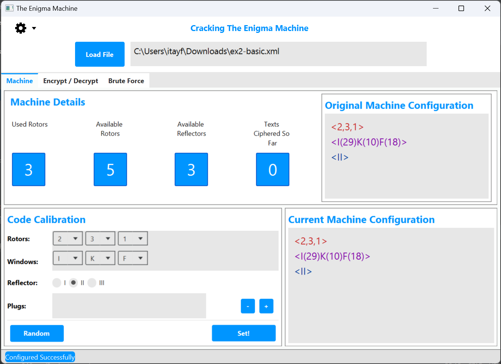
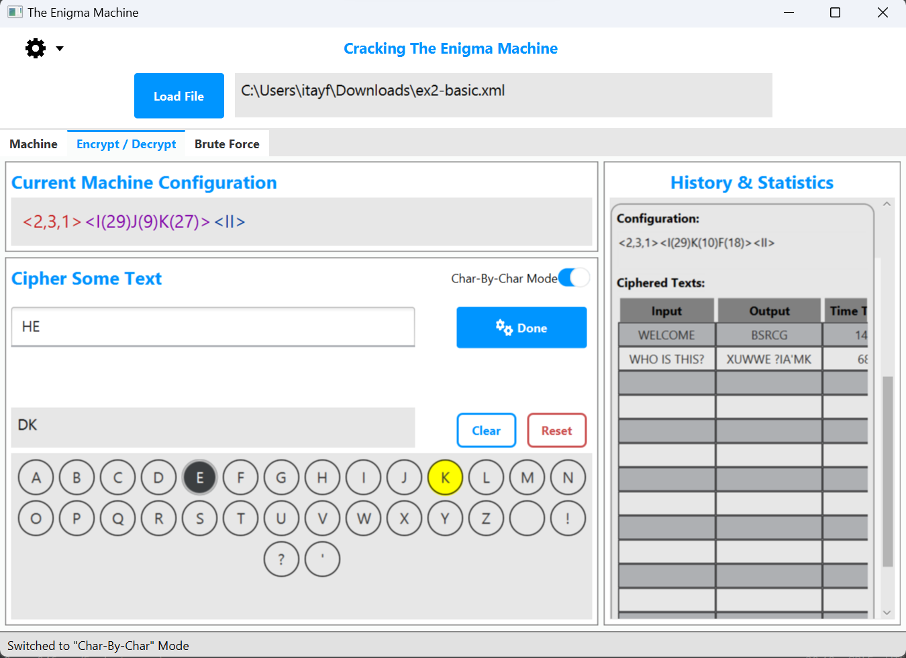
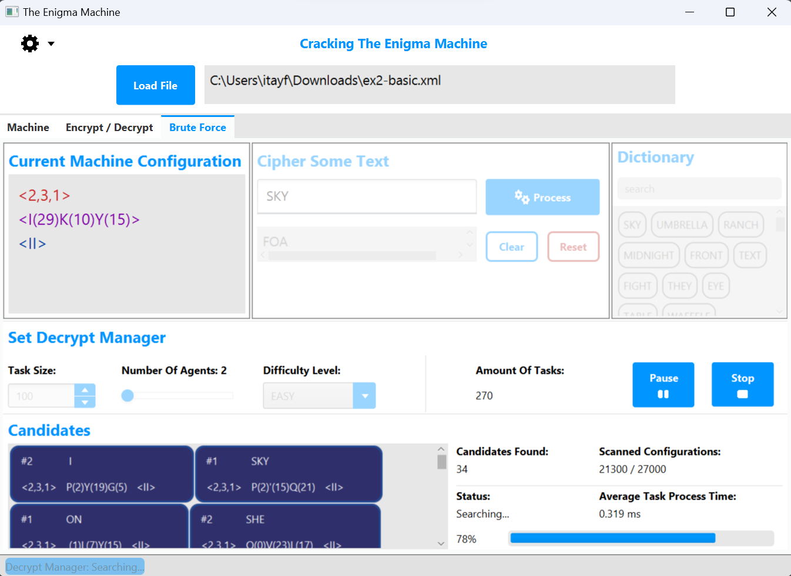

# Enigma Decrypt Manager
Built as part of Aviad Cohen's Java course at The Academic Collage Of Tel-Aviv Yaffo.

##### In this project, we've built a Desktop application using JavaFX. 
The application let the user operate a virtual Enigma machine.
This project is a direct continuation of the project [Virtual Enigma Machine](https://github.com/itayf9/Virtual_Enigma_Machine)

## Load various of Enigma machines
Based on XML files.

## Configure your own machine
Change different parameters that determine the machine's configuration (change it manualy or randomly).

## Encrypt and decrypt messages.
You can cipher a whole message, of in "Char-by-Char" mode.

## See history and statistics of the ciphered text.

## Operate a Dycrypt Manager
Automatic decrypting mode. The decrypting is done in a multithreaded brute force.
You can pause/stop the auto decrypting.

